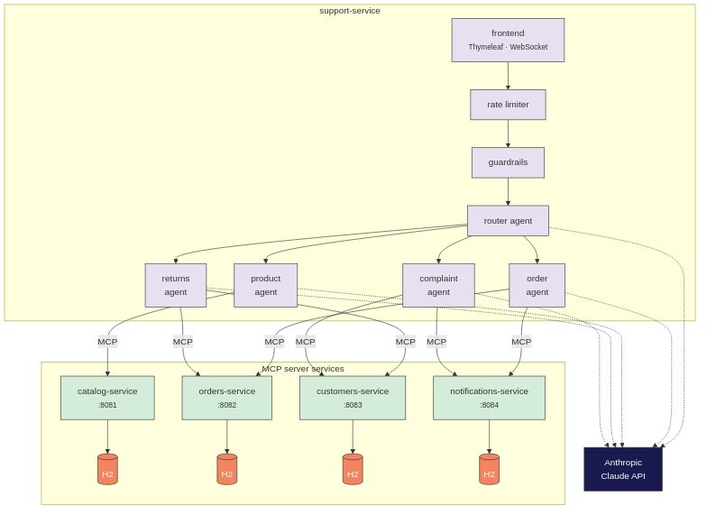

# Cloud Cart Support

A distributed multi-agent AI customer service system built with Spring Boot, Spring AI, and the Model Context Protocol (MCP). Uses Claude to intelligently route and handle customer inquiries across specialized domain agents backed by independent microservices.

## Table of Contents

- [Background](#background)
- [Architecture](#architecture)
- [Project Structure](#project-structure)
- [Prerequisites](#prerequisites)
- [Install](#install)
- [Usage](#usage)
- [Kubernetes](#kubernetes)
- [API](#api)
- [Demo Script](#demo-script)
- [Maintainers](#maintainers)
- [License](#license)

## Background

Cloud Cart Support demonstrates a distributed multi-agent architecture for AI-powered customer service. A router agent classifies incoming customer messages by intent and delegates them to the appropriate specialist agent. Each agent discovers and calls domain-specific tools exposed by independent MCP server microservices over Streamable HTTP transport.

Key features:

- **Intent-based routing** -- A router agent classifies messages and hands off to specialist agents with full conversation context.
- **Guardrails** -- Input screening detects and redacts PII (SSN, credit card, email, phone) and blocks off-topic content before it reaches any agent.
- **MCP tool discovery** -- Agents call tools exposed by remote MCP server services, discovered automatically via the Spring AI MCP client.
- **Microservice architecture** -- Each domain (catalog, orders, customers, notifications) runs as an independent Spring Boot service with its own database (in-memory H2 by default, PostgreSQL via the `external-database` Spring profile).
- **WebSocket support** -- Real-time chat interface via WebSocket in addition to REST endpoints.
- **Conversation context** -- Full conversation history, handoff tracking, and metadata are maintained across agent transfers.

## Architecture



The system is composed of:

| Component | Description |
|---|---|
| **Frontend** | Thymeleaf templates with WebSocket client |
| **Guardrails** | PII detection/redaction and off-topic filtering |
| **Router Agent** | Classifies intent and delegates to specialist agents |
| **Order Agent** | Handles order status, tracking, cancellations, and shipping |
| **Product Agent** | Handles product search, recommendations, and availability |
| **Returns Agent** | Handles return requests, refunds, and exchange questions |
| **Complaint Agent** | Handles complaints, escalations, and service issues |
| **Catalog Service** | MCP server exposing product search, details, availability, and recommendation tools |
| **Orders Service** | MCP server exposing order status, tracking, cancellation, and return tools |
| **Customers Service** | MCP server exposing customer info, loyalty points, notes, and credit tools |
| **Notifications Service** | MCP server exposing email, SMS, ticket, and escalation tools |
| **Anthropic Claude API** | LLM backing all agent reasoning and tool use |

## Project Structure

This is a Maven multi-module monorepo:

```
cloud-cart-support-java/
├── pom.xml                    # Parent aggregator POM
├── docker-compose.yaml        # Run all services together
├── support-service/           # Orchestrator (agents, routing, frontend) - port 8080
├── catalog-service/           # MCP server: product tools - port 8081
├── orders-service/            # MCP server: order tools - port 8082
├── customers-service/         # MCP server: customer tools - port 8083
└── notifications-service/     # MCP server: notification tools - port 8084
```

Each MCP server service owns its data and exposes tools via Streamable HTTP transport using `spring-ai-starter-mcp-server-webflux`. The orchestrator (`support-service`) connects to all MCP servers as a client and routes discovered tools to the appropriate agents.

## Prerequisites

- Java 21
- Maven (or use the included Maven wrapper)
- Docker and Docker Compose (for containerized deployment)
- An [Anthropic API key](https://console.anthropic.com/)

## Install

Clone the repository and build all modules:

```sh
git clone <repository-url>
cd cloud-cart-support-java
./mvnw clean install
```

## Usage

### Running with Docker Compose

The simplest way to run all services together:

```sh
export ANTHROPIC_API_KEY=your-api-key
docker compose up --build
```

### Running locally

Start each MCP server service, then start the orchestrator:

```sh
export ANTHROPIC_API_KEY=your-api-key

# Start MCP server services (each in a separate terminal)
./mvnw -pl catalog-service spring-boot:run
./mvnw -pl orders-service spring-boot:run
./mvnw -pl customers-service spring-boot:run
./mvnw -pl notifications-service spring-boot:run

# Start the orchestrator
./mvnw -pl support-service spring-boot:run
```

The orchestrator starts on `http://localhost:8080`. Open the web UI in a browser to chat with the support agents, or use the REST API directly.

### Example

```sh
curl -X POST http://localhost:8080/chat \
  -H "Content-Type: application/json" \
  -d '{"message": "Where is my order?", "customer_id": "C001"}'
```

## Kubernetes

The application runs on Kubernetes with [kgateway](https://kgateway.dev) as the ingress gateway. Container images are published to GHCR on tag push via GitHub Actions.

### Cluster Setup

Install Gateway API CRDs, kgateway, and Enterprise Agent Gateway:

```sh
# Install Gateway API CRDs
kubectl apply -f https://github.com/kubernetes-sigs/gateway-api/releases/download/v1.4.0/standard-install.yaml

# Install kgateway (ingress)
helm upgrade -i kgateway-crds oci://ghcr.io/kgateway-dev/charts/kgateway-crds --namespace kgateway-system --create-namespace --version v2.2.0
helm upgrade -i kgateway oci://ghcr.io/kgateway-dev/charts/kgateway --namespace kgateway-system --version v2.2.0

# Install Enterprise Agent Gateway (source .env for license key first)
k8s/agentgateway/install.sh
```

### Deploy the Application

```sh
# Build and push container images (requires a tag push to trigger GH Actions)
git tag v0.1.0 && git push origin v0.1.0

# Deploy namespace, secret, and all services
k8s/deploy.sh

# Access the UI
kubectl port-forward svc/support-service -n cloud-cart-support 8080:8080
```

### Ingress Gateway

Apply the kgateway `Gateway`, `HTTPRoute`, and `HTTPListenerPolicy` to expose the support-service externally and enable WebSocket upgrades:

```sh
kubectl apply -f k8s/kgateway/gateway.yaml
kubectl apply -f k8s/kgateway/httproute.yaml
kubectl apply -f k8s/kgateway/httplistenerpolicy.yaml
```

Or use the convenience script:

```sh
k8s/kgateway/apply.sh
```

| Resource | Kind | Namespace | Purpose |
|---|---|---|---|
| `cloud-cart-gateway` | Gateway | kgateway-system | Listener on port 80, `gatewayClassName: kgateway` |
| `support-service-route` | HTTPRoute | cloud-cart-support | Routes `/support` to `support-service:8080` with URL rewrite |
| `websocket-upgrade` | HTTPListenerPolicy | kgateway-system | Enables WebSocket upgrade on the gateway |

```sh
# Get the external IP
kubectl get svc cloud-cart-gateway -n kgateway-system -o jsonpath='{.status.loadBalancer.ingress[0].ip}'
```

### File Layout

```
k8s/
├── namespace.yaml                  # cloud-cart-support namespace
├── secret.yaml                     # Anthropic API key
├── catalog-service.yaml            # Deployment + ClusterIP Service
├── orders-service.yaml             # Deployment + ClusterIP Service
├── customers-service.yaml          # Deployment + ClusterIP Service
├── notifications-service.yaml      # Deployment + ClusterIP Service
├── support-service.yaml            # Deployment + NodePort Service
├── build-images.sh                 # Docker build + GHCR push
├── deploy.sh                       # Full deployment orchestrator
├── kgateway/
│   ├── gateway.yaml                # Gateway (cloud-cart-gateway, port 80)
│   ├── httproute.yaml              # HTTPRoute (/support → support-service:8080)
│   ├── httplistenerpolicy.yaml     # HTTPListenerPolicy (WebSocket upgrade)
│   └── apply.sh                    # Apply all kgateway resources
└── agentgateway/
    └── install.sh                  # Helm install (Gateway API CRDs + Enterprise AG)
```

For the progressive Agent Gateway demo recipe, see [docs/recipe.md](docs/recipe.md).

## API

### `POST /chat`

Send a chat message. The router agent classifies the intent and delegates to the appropriate specialist agent.

**Request body:**

| Field | Type | Required | Description |
|---|---|---|---|
| `message` | string | yes | The customer's message |
| `conversation_id` | string | no | ID of an existing conversation to continue |
| `customer_id` | string | no | Customer ID to associate with the conversation |

**Response:**

```json
{
  "response": "Agent's reply text",
  "conversation_id": "uuid",
  "agent": "order",
  "tool_calls": [],
  "handoff": {
    "from_agent": "router",
    "to_agent": "order",
    "reason": "Intent classified as 'order' (confidence: 0.98)"
  }
}
```

### `GET /conversations/{conversationId}`

Retrieve conversation history including turns, handoffs, and metadata.

### `GET /health`

Health check endpoint.

## Demo Script

This section walks through the key features of Cloud Cart Support using concrete examples against the seeded data. Each section demonstrates a distinct capability of the multi-agent system.

Start the application before running the demo (via Docker Compose, locally, or on Kubernetes). The app serves on port 8080. You can use the web UI in a browser or `curl` against the REST API.

### 1. Intent-Based Routing

The router agent classifies every incoming message and hands off to the right specialist.

**Greeting (handled by router directly):**

```sh
curl -s -X POST http://localhost:8080/chat \
  -H "Content-Type: application/json" \
  -d '{"message": "Hi there!", "customer_id": "CUST-001"}' | jq .
```

**Order question (routed to order agent):**

```sh
curl -s -X POST http://localhost:8080/chat \
  -H "Content-Type: application/json" \
  -d '{"message": "Where is my order ORD-2024-0003?", "customer_id": "CUST-003"}' | jq .
```

Note the `handoff` field in the response showing the transfer from `router` to `order` with the confidence score.

### 2. Order Tracking and Management

**Track a shipped order** (ORD-2024-0003, Emily Rodriguez, tracking `1Z999AA10123456786`):

```sh
curl -s -X POST http://localhost:8080/chat \
  -H "Content-Type: application/json" \
  -d '{"message": "Can you track order ORD-2024-0003?", "customer_id": "CUST-003"}' | jq .
```

**Cancel a pending order** (ORD-2024-0005, Amanda Taylor, `pending` status):

```sh
curl -s -X POST http://localhost:8080/chat \
  -H "Content-Type: application/json" \
  -d '{"message": "I need to cancel order ORD-2024-0005", "customer_id": "CUST-005"}' | jq .
```

**Attempt to cancel a shipped order** (ORD-2024-0006, should be denied):

```sh
curl -s -X POST http://localhost:8080/chat \
  -H "Content-Type: application/json" \
  -d '{"message": "Cancel order ORD-2024-0006 please", "customer_id": "CUST-006"}' | jq .
```

### 3. Product Search and Recommendations

```sh
curl -s -X POST http://localhost:8080/chat \
  -H "Content-Type: application/json" \
  -d '{"message": "Do you have any wireless earbuds?", "customer_id": "CUST-001"}' | jq .
```

**Multi-term search:**

```sh
curl -s -X POST http://localhost:8080/chat \
  -H "Content-Type: application/json" \
  -d '{"message": "I am looking for a blender and a charger", "customer_id": "CUST-002"}' | jq .
```

### 4. Returns and Refunds

The return policy: 30-day window, items in original condition, $5.99 return fee for non-defective items.

**Initiate a return on a delivered order** (ORD-2024-0001, Sarah Johnson):

```sh
curl -s -X POST http://localhost:8080/chat \
  -H "Content-Type: application/json" \
  -d '{"message": "I want to return my order ORD-2024-0001, the headset does not fit well", "customer_id": "CUST-001"}' | jq .
```

### 5. Complaint Handling and Escalation

**Standard complaint:**

```sh
curl -s -X POST http://localhost:8080/chat \
  -H "Content-Type: application/json" \
  -d '{"message": "I received a damaged product in my order and I am very disappointed", "customer_id": "CUST-004"}' | jq .
```

**Escalation trigger** (keywords: "lawyer", "manager", "unacceptable", etc.):

```sh
curl -s -X POST http://localhost:8080/chat \
  -H "Content-Type: application/json" \
  -d '{"message": "This is unacceptable! I want to speak to a manager immediately.", "customer_id": "CUST-004"}' | jq .
```

### 6. Guardrails -- PII Detection and Content Filtering

**PII redaction** (SSN and credit card are redacted before reaching the agent):

```sh
curl -s -X POST http://localhost:8080/chat \
  -H "Content-Type: application/json" \
  -d '{"message": "My SSN is 123-45-6789 and my card is 4111 1111 1111 1111, can you check my order?", "customer_id": "CUST-001"}' | jq .
```

**Off-topic blocking:**

```sh
curl -s -X POST http://localhost:8080/chat \
  -H "Content-Type: application/json" \
  -d '{"message": "How do I hack into someone account?", "customer_id": "CUST-001"}' | jq .
```

### 7. Multi-Turn Conversations

```sh
# Turn 1
RESPONSE=$(curl -s -X POST http://localhost:8080/chat \
  -H "Content-Type: application/json" \
  -d '{"message": "What is the status of order ORD-2024-0008?", "customer_id": "CUST-008"}')
echo "$RESPONSE" | jq .
CONV_ID=$(echo "$RESPONSE" | jq -r '.conversation_id')

# Turn 2 (same conversation)
curl -s -X POST http://localhost:8080/chat \
  -H "Content-Type: application/json" \
  -d "{\"message\": \"Can you also tell me what products were in that order?\", \"conversation_id\": \"$CONV_ID\"}" | jq .
```

### Quick Reference: Seed Data

**Order statuses:**

| Status | Example Orders |
|---|---|
| delivered | ORD-2024-0001, ORD-2024-0002, ORD-2024-0004, ORD-2024-0010 |
| shipped | ORD-2024-0003, ORD-2024-0006, ORD-2024-0008 |
| pending | ORD-2024-0005, ORD-2024-0012, ORD-2024-0016 |
| cancelled | ORD-2024-0009, ORD-2024-0018 |

**Notable customers:**

| Customer | Points | Tier |
|---|---|---|
| CUST-010 Thomas Brown | 5100 | Platinum |
| CUST-004 James Wilson | 3200 | Gold |
| CUST-001 Sarah Johnson | 2450 | Silver |
| CUST-008 Robert Anderson | 450 | Bronze |

**Product categories:** electronics, kitchen, sports, beauty, toys, home, pets, office, automotive, tools (50 products total)

## Maintainers

[@brianjimerson](https://github.com/brianjimerson)

## License

[Apache-2.0](LICENSE)
