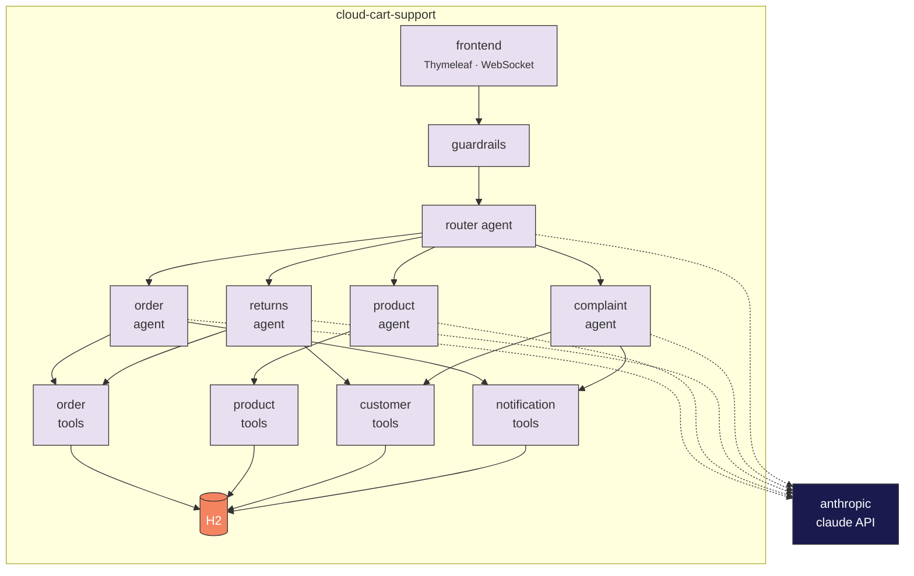

```mermaid
graph TD
    subgraph cloud-cart-support
        frontend["frontend<br/><small>Thymeleaf · WebSocket</small>"]

        frontend --> guardrails["guardrails"]
        guardrails --> router["router agent"]

        router --> order_agent["order<br/>agent"]
        router --> product_agent["product<br/>agent"]
        router --> returns_agent["returns<br/>agent"]
        router --> complaint_agent["complaint<br/>agent"]

        order_agent --> order_tools["order<br/>tools"]
        order_agent --> notification_tools["notification<br/>tools"]
        product_agent --> product_tools["product<br/>tools"]
        returns_agent --> order_tools
        returns_agent --> customer_tools["customer<br/>tools"]
        complaint_agent --> customer_tools
        complaint_agent --> notification_tools

        order_tools --> db[("H2")]
        product_tools --> db
        customer_tools --> db
        notification_tools --> db
    end

    order_agent -..-> claude
    product_agent -..-> claude
    returns_agent -..-> claude
    complaint_agent -..-> claude
    router -..-> claude["anthropic<br/>claude API"]

    style frontend fill:#e8e0f0,stroke:#333
    style guardrails fill:#e8e0f0,stroke:#333
    style router fill:#e8e0f0,stroke:#333
    style order_agent fill:#e8e0f0,stroke:#333
    style product_agent fill:#e8e0f0,stroke:#333
    style returns_agent fill:#e8e0f0,stroke:#333
    style complaint_agent fill:#e8e0f0,stroke:#333
    style order_tools fill:#e8e0f0,stroke:#333
    style product_tools fill:#e8e0f0,stroke:#333
    style customer_tools fill:#e8e0f0,stroke:#333
    style notification_tools fill:#e8e0f0,stroke:#333
    style db fill:#f4845f,stroke:#333,color:#fff
    style claude fill:#1a1a4e,stroke:#333,color:#fff
```
