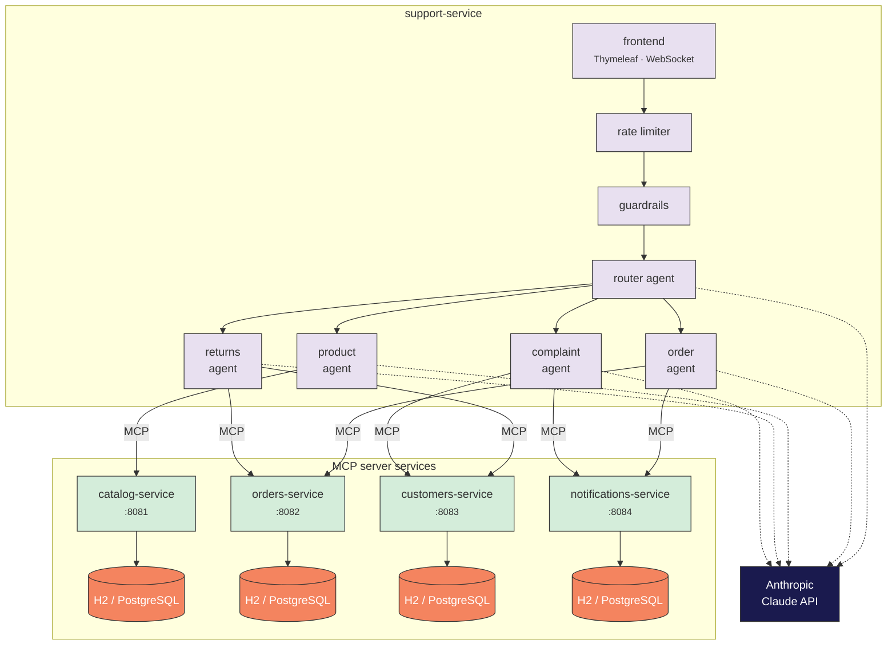

```mermaid
graph TD
    subgraph support-service ["support-service"]
        frontend["frontend<br/><small>Thymeleaf · WebSocket</small>"]
        ratelimit["rate limiter"]
        guardrails["guardrails"]
        router["router agent"]
        order_agent["order<br/>agent"]
        product_agent["product<br/>agent"]
        returns_agent["returns<br/>agent"]
        complaint_agent["complaint<br/>agent"]

        frontend --> ratelimit --> guardrails --> router
        router --> order_agent
        router --> product_agent
        router --> returns_agent
        router --> complaint_agent
    end

    subgraph mcp-servers ["MCP server services"]
        catalog["catalog-service<br/><small>:8081</small>"]
        orders["orders-service<br/><small>:8082</small>"]
        customers["customers-service<br/><small>:8083</small>"]
        notifications["notifications-service<br/><small>:8084</small>"]

        catalog --> catalog_db[("H2 / PostgreSQL")]
        orders --> orders_db[("H2 / PostgreSQL")]
        customers --> customers_db[("H2 / PostgreSQL")]
        notifications --> notifications_db[("H2 / PostgreSQL")]
    end

    order_agent -->|MCP| orders
    order_agent -->|MCP| notifications
    product_agent -->|MCP| catalog
    returns_agent -->|MCP| orders
    returns_agent -->|MCP| customers
    complaint_agent -->|MCP| customers
    complaint_agent -->|MCP| notifications

    router -..-> claude
    order_agent -..-> claude
    product_agent -..-> claude
    returns_agent -..-> claude
    complaint_agent -..-> claude["Anthropic<br/>Claude API"]

    style frontend fill:#e8e0f0,stroke:#333
    style ratelimit fill:#e8e0f0,stroke:#333
    style guardrails fill:#e8e0f0,stroke:#333
    style router fill:#e8e0f0,stroke:#333
    style order_agent fill:#e8e0f0,stroke:#333
    style product_agent fill:#e8e0f0,stroke:#333
    style returns_agent fill:#e8e0f0,stroke:#333
    style complaint_agent fill:#e8e0f0,stroke:#333
    style catalog fill:#d4edda,stroke:#333
    style orders fill:#d4edda,stroke:#333
    style customers fill:#d4edda,stroke:#333
    style notifications fill:#d4edda,stroke:#333
    style catalog_db fill:#f4845f,stroke:#333,color:#fff
    style orders_db fill:#f4845f,stroke:#333,color:#fff
    style customers_db fill:#f4845f,stroke:#333,color:#fff
    style notifications_db fill:#f4845f,stroke:#333,color:#fff
    style claude fill:#1a1a4e,stroke:#333,color:#fff
```
