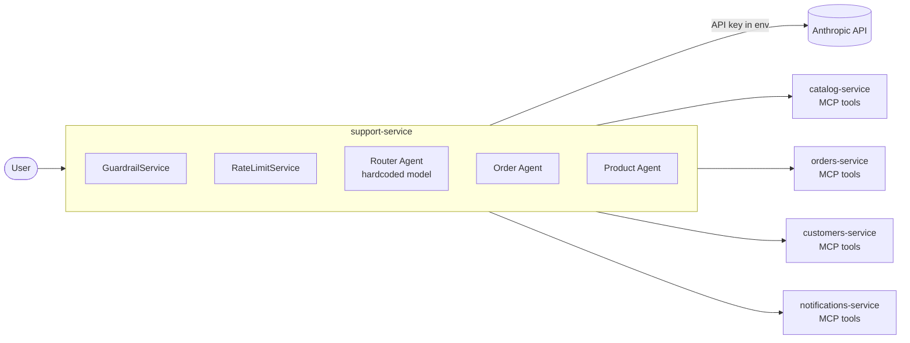
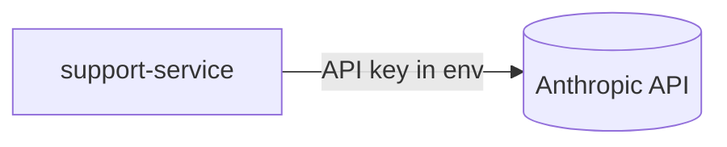
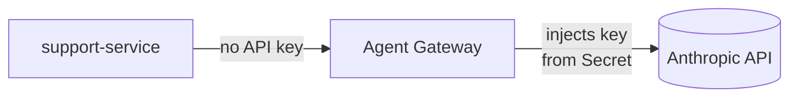
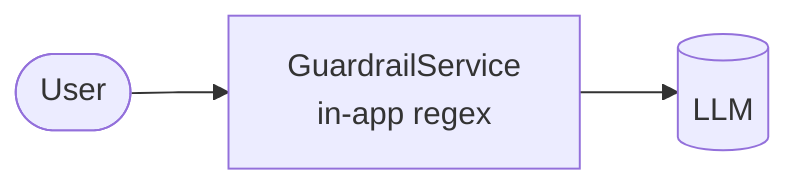
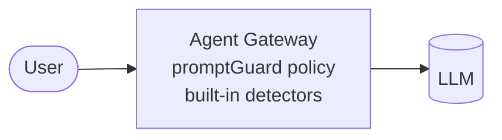
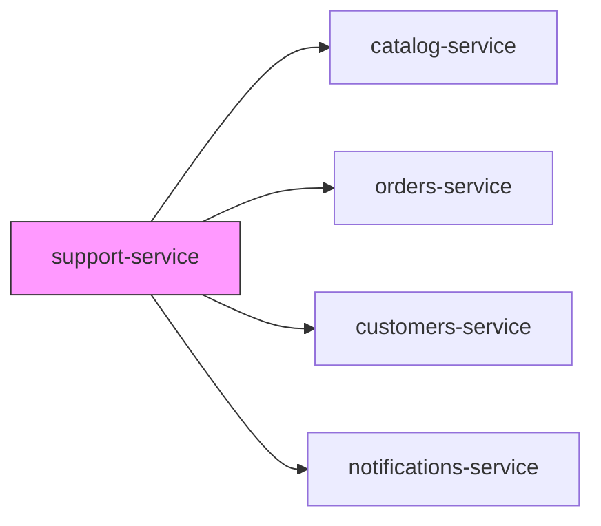
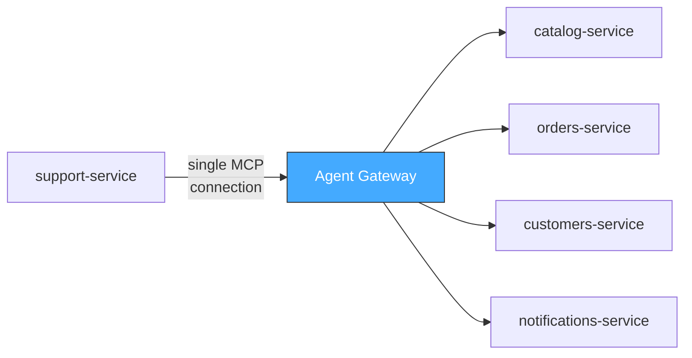

# Cloud Cart Support: Enterprise Agent Gateway Demo Recipe

A step-by-step walkthrough for demonstrating progressive migration from in-app AI plumbing to Solo.io's Enterprise Agent Gateway on Kubernetes. Each step is a separate Git branch that replaces application code with declarative gateway-managed CRDs.

## Table of Contents

- [Prerequisites](#prerequisites)
- [Environment Setup](#environment-setup)
- [Step 0: Baseline](#step-0-baseline)
- [Step 1: API Key Management](#step-1-api-key-management)
- [Step 2: Prompt Guards](#step-2-prompt-guards)
- [Step 3: Model Configuration](#step-3-model-configuration)
- [Step 4: Rate Limiting](#step-4-rate-limiting)
- [Step 5: Observability](#step-5-observability)
- [Step 6: MCP Federation](#step-6-mcp-federation)
- [Cleanup](#cleanup)
- [Troubleshooting](#troubleshooting)

---

## Prerequisites

- A clean Kubernetes cluster with `kubectl` configured
- Helm 3.x
- `jq` (for formatting JSON responses)
- `curl`
- Git (to switch between demo branches)
- Clone this repository and `cd` into it

---

## Environment Setup

This one-time setup installs the platform infrastructure needed for all demo steps.

### 1. Load environment variables

```bash
source .env
```

This exports `ANTHROPIC_API_KEY`, `ENTERPRISE_AGENTGATEWAY_LICENSE_KEY`, `ENTERPRISE_KGATEWAY_LICENSE_KEY`, and version variables.

### 2. Install Gateway API CRDs

```bash
kubectl apply -f https://github.com/kubernetes-sigs/gateway-api/releases/download/v1.4.0/standard-install.yaml
```

### 3. Install Solo Enterprise for kgateway (ingress)

```bash
helm upgrade -i enterprise-kgateway-crds \
  oci://us-docker.pkg.dev/solo-public/enterprise-kgateway/charts/enterprise-kgateway-crds \
  --namespace kgateway-system --create-namespace \
  --version "${ENTERPRISE_KGATEWAY_VERSION}"

helm upgrade -i enterprise-kgateway \
  oci://us-docker.pkg.dev/solo-public/enterprise-kgateway/charts/enterprise-kgateway \
  --namespace kgateway-system \
  --version "${ENTERPRISE_KGATEWAY_VERSION}" \
  --set licensing.licenseKey="${ENTERPRISE_KGATEWAY_LICENSE_KEY}"
```

### 4. Install Solo Enterprise for Agent Gateway

> **Note:** Enterprise kgateway and Enterprise Agent Gateway share some CRDs (extauth, ratelimit). Use `helm template` + server-side apply for the CRDs to avoid ownership conflicts, then install the control plane normally.

```bash
# CRDs (server-side apply to handle shared CRD ownership with kgateway)
helm template enterprise-agentgateway-crds \
  oci://us-docker.pkg.dev/solo-public/enterprise-agentgateway/charts/enterprise-agentgateway-crds \
  --version "${ENTERPRISE_AGENTGATEWAY_VERSION}" \
  | kubectl apply --server-side --force-conflicts --validate=false -f -

# Control plane (use a values file because --set/--set-string can mangle the JWT license key)
kubectl create namespace agentgateway-system --dry-run=client -o yaml | kubectl apply -f -
cat <<VALS > /tmp/agw-values.yaml
licensing:
  licenseKey: "${ENTERPRISE_AGENTGATEWAY_LICENSE_KEY}"
VALS
helm upgrade -i enterprise-agentgateway \
  oci://us-docker.pkg.dev/solo-public/enterprise-agentgateway/charts/enterprise-agentgateway \
  --namespace agentgateway-system --create-namespace \
  --version "${ENTERPRISE_AGENTGATEWAY_VERSION}" \
  -f /tmp/agw-values.yaml
rm /tmp/agw-values.yaml
```

### 5. Verify infrastructure

```bash
# kgateway pods
kubectl get pods -n kgateway-system

# Agent Gateway pods
kubectl get pods -n agentgateway-system

# GatewayClasses registered
kubectl get gatewayclasses
```

All pods should be `Running` and both `enterprise-kgateway` and `enterprise-agentgateway` GatewayClasses should show `Accepted`.

### 6. Apply kgateway ingress resources

> **Note:** The HTTPRoute is in the `cloud-cart-support` namespace. Apply the Gateway and policy first, then apply the HTTPRoute after deploying the application (Step 0) which creates the namespace.

```bash
kubectl apply -f k8s/kgateway/gateway.yaml
kubectl apply -f k8s/kgateway/httplistenerpolicy.yaml
```

Get the external IP (may take a minute for the load balancer):

```bash
kubectl get gateway cloud-cart-gateway -n kgateway-system
```

Save the external IP for later:

```bash
export GATEWAY_IP=$(kubectl get svc cloud-cart-gateway -n kgateway-system \
  -o jsonpath='{.status.loadBalancer.ingress[0].ip}')
echo "Gateway IP: $GATEWAY_IP"
```

---

## Step 0: Baseline

**Branch:** `main`

### Current State

The application runs with all AI plumbing implemented in application code:

- `ANTHROPIC_API_KEY` injected as a pod environment variable from a Kubernetes Secret
- `GuardrailService.java` performs regex-based PII detection (SSN, credit card, email, phone) and off-topic content filtering
- `RateLimitService.java` implements in-memory per-client rate limiting (20 requests/60 seconds)
- Model name (`claude-sonnet-4-5-20250929`) and `maxTokens` (4096) hardcoded in `application.yml`
- Each agent connects directly to 4 MCP server microservices via hardcoded URLs
- No LLM-specific observability

### Challenges

| Concern | Problem |
|---------|---------|
| API keys | Every app stores its own LLM credentials; rotation requires redeployment |
| Guardrails | PII patterns are hand-rolled regex; changes require code deploys |
| Model config | Model upgrades are code changes; no org-wide enforcement |
| Rate limiting | In-memory counters don't work across replicas |
| Observability | No token usage, cost attribution, or LLM-specific metrics |
| MCP discovery | Each app hardcodes every MCP server URL |

### Desired Outcome

A working baseline to demonstrate the application and compare against gateway-managed steps.

### Architecture



### Deploy

```bash
git checkout main

# Create the API key secret with the real key from .env
kubectl create namespace cloud-cart-support --dry-run=client -o yaml | kubectl apply -f -
kubectl create secret generic anthropic-api-key \
  -n cloud-cart-support \
  --from-literal=ANTHROPIC_API_KEY="${ANTHROPIC_API_KEY}" \
  --dry-run=client -o yaml | kubectl apply -f -

# Deploy all services
k8s/deploy.sh

# Apply the kgateway HTTPRoute (namespace now exists)
kubectl apply -f k8s/kgateway/httproute.yaml
```

### Verify

```bash
# Health check
curl -s http://${GATEWAY_IP}/health | jq .

# Send a chat message
curl -s -X POST http://${GATEWAY_IP}/chat \
  -H "Content-Type: application/json" \
  -d '{"message": "Where is my order ORD-2024-0003?", "customer_id": "CUST-003"}' | jq .

# Test PII guardrails (in-app)
curl -s -X POST http://${GATEWAY_IP}/chat \
  -H "Content-Type: application/json" \
  -d '{"message": "My SSN is 123-45-6789", "customer_id": "CUST-001"}' | jq .

# Test off-topic blocking (in-app)
curl -s -X POST http://${GATEWAY_IP}/chat \
  -H "Content-Type: application/json" \
  -d '{"message": "How do I hack into someone account?", "customer_id": "CUST-001"}' | jq .
```

> **Demo talking point:** Walk through the code — show `GuardrailService.java`, `RateLimitService.java`, the hardcoded model in `application.yml`, and the API key in the pod env. These are all concerns that belong at the platform level, not in application code.

---

## Step 1: API Key Management

**Branch:** `demo/step-1-api-keys`

### Current State

Application connects directly to Anthropic with `ANTHROPIC_API_KEY` stored in a Kubernetes Secret and injected into every pod that needs LLM access.

### Challenges

- Every app that uses an LLM needs its own copy of the API key
- Key rotation requires redeploying every app
- Secrets spread across multiple namespaces
- No centralized credential management or audit trail

### Desired Outcome

The application points to Enterprise Agent Gateway instead of Anthropic. The gateway injects the API key via backend auth. The app never sees or stores the key.

### Architecture (Before → After)

**Before:**


**After:**


### What Changes

**Code removed:**
- `RequiredEnvChecker.java` — startup API key validation no longer needed

**Code changed:**
- `application.yml` — `base-url` points to gateway; `api-key: not-used`
- `support-service.yaml` — env var `SPRING_AI_ANTHROPIC_BASE_URL` points to `agentgateway.agentgateway-system.svc:8080`

**CRDs added:**
- `k8s/agentgateway/backend-anthropic.yaml` — AgentgatewayBackend with `backendAuth` referencing the API key Secret
- `k8s/agentgateway/gateway.yaml` — Gateway (enterprise-agentgateway class, port 8080)
- `k8s/agentgateway/route-ai.yaml` — HTTPRoute routing LLM traffic to the Anthropic backend
- `k8s/agentgateway/policy-ai-routes.yaml` — EnterpriseAgentgatewayPolicy enabling bidirectional protocol translation between Anthropic `/v1/messages` format and OpenAI `/v1/chat/completions` format

**Secret moved:**
- `k8s/secret.yaml` — now in `agentgateway-system` namespace with `Authorization: <key>` format (the gateway translates this to `x-api-key` for Anthropic)

> **Protocol Translation:** The Agent Gateway acts as a universal LLM proxy. The `ai-routes` policy enables the gateway to accept requests in either OpenAI format (`/v1/chat/completions`) or Anthropic native format (`/v1/messages` with content blocks), and automatically translate to the backend provider's native API. This means your application code doesn't need to change if you switch LLM providers — only the `AgentgatewayBackend` configuration changes.

### Deploy

```bash
git checkout demo/step-1-api-keys

# Create the API key secret in agentgateway-system
kubectl create secret generic anthropic-api-key \
  -n agentgateway-system \
  --from-literal=Authorization="${ANTHROPIC_API_KEY}" \
  --dry-run=client -o yaml | kubectl apply -f -

# Deploy application + Agent Gateway CRDs
k8s/deploy.sh
```

### Verify

```bash
# Gateway accepted the backend
kubectl get agentgatewaybackend -n agentgateway-system

# HTTPRoute bound
kubectl get httproute -n agentgateway-system

# Agent Gateway has an address
kubectl get gateway agentgateway -n agentgateway-system

# Chat still works (traffic now flows through gateway)
curl -s -X POST http://${GATEWAY_IP}/chat \
  -H "Content-Type: application/json" \
  -d '{"message": "Where is my order ORD-2024-0003?", "customer_id": "CUST-003"}' | jq .

# Confirm: app no longer has the API key
kubectl get deploy support-service -n cloud-cart-support \
  -o jsonpath='{.spec.template.spec.containers[0].env[*].name}' | tr ' ' '\n' | grep -i anthrop
# Should NOT show ANTHROPIC_API_KEY
```

> **Demo talking point:** The application code is simpler — no API key validation. Key rotation is now a Secret update, not an app redeploy. Every app behind the gateway shares the same credential management.

---

## Step 2: Prompt Guards

**Branch:** `demo/step-2-prompt-guards`

### Current State

`GuardrailService.java` (82 lines) performs:
- PII detection via regex (SSN, credit card, email, phone)
- Off-topic content filtering via pattern matching
- PII masking before messages reach the LLM

### Challenges

- Guardrails are app-specific code, not platform-wide policy
- Adding new PII patterns (e.g., Canadian SIN) requires code changes and redeployment
- Different apps may implement guardrails inconsistently
- Regex-based detection is fragile and hard to test comprehensively

### Desired Outcome

Remove `GuardrailService` entirely. Replace with an `EnterpriseAgentgatewayPolicy` CRD that enforces prompt guards at the gateway level with built-in PII detectors.

### Architecture (Before → After)

**Before:**


**After:**


### What Changes

**Code removed:**
- `GuardrailService.java` — PII detection and content filtering
- `GuardrailResult.java` — model class
- `GuardrailServiceTest.java` — tests
- Guardrail calls removed from `ChatController.java` and `ChatWebSocketHandler.java`

**CRDs added:**
- `k8s/agentgateway/policy.yaml` — EnterpriseAgentgatewayPolicy with:
  - `backend.ai.promptGuard.request[].regex` — rejection patterns for violence, weapons, drugs, hacking, fraud, etc. (action: Reject, HTTP 403)
  - `backend.ai.promptGuard.request[].regex.builtins` — PII masking for CreditCard, Ssn, Email, PhoneNumber (action: Mask)

### Deploy

```bash
git checkout demo/step-2-prompt-guards
k8s/deploy.sh
```

### Verify

```bash
# Policy created
kubectl get enterpriseagentgatewaypolicy -n agentgateway-system

# PII masking (SSN should be masked by gateway, not app)
curl -s -X POST http://${GATEWAY_IP}/chat \
  -H "Content-Type: application/json" \
  -d '{"message": "My SSN is 123-45-6789 and my card is 4111 1111 1111 1111", "customer_id": "CUST-001"}' | jq .

# Off-topic rejection (blocked at gateway)
curl -s -X POST http://${GATEWAY_IP}/chat \
  -H "Content-Type: application/json" \
  -d '{"message": "How do I hack into someone account?", "customer_id": "CUST-001"}' | jq .

# Normal chat still works
curl -s -X POST http://${GATEWAY_IP}/chat \
  -H "Content-Type: application/json" \
  -d '{"message": "What products do you have?", "customer_id": "CUST-001"}' | jq .
```

> **Demo talking point:** Show the diff — 82 lines of Java code replaced by a YAML policy. New PII types or content rules are a `kubectl apply`, not a code deploy.

---

## Step 3: Model Configuration

**Branch:** `demo/step-3-model-config`

### Current State

Model name (`claude-sonnet-4-5-20250929`) and `maxTokens` (4096) are hardcoded in `application.yml`. Each agent references the model directly.

### Challenges

- Model upgrades require code/config changes and redeployment
- No org-wide enforcement of token limits or model usage
- Different apps may drift to different model versions
- No model aliasing (apps are tightly coupled to specific model names)

### Desired Outcome

Model configuration managed via `AgentgatewayPolicy`. The app uses a placeholder model name; the gateway enforces the real model, temperature, and token limits.

### What Changes

**Code changed:**
- `application.yml` — model changed to `placeholder`, max-tokens removed
- `BaseToolAgent.java` and `RouterAgent.java` — hardcoded model references removed

**CRDs changed:**
- `k8s/agentgateway/backend-anthropic.yaml` — `anthropic.model` set to `claude-sonnet-4-5-20250929` (the backend-level model overrides whatever the client sends, so the app's `placeholder` value is replaced)

**CRDs added:**
- `k8s/agentgateway/model-policy.yaml` — AgentgatewayPolicy with:
  - `defaults.temperature: 0.7`
  - `overrides.max_tokens: 4096`

### Deploy

```bash
git checkout demo/step-3-model-config
k8s/deploy.sh
```

### Verify

```bash
# Policy created
kubectl get agentgatewaypolicy -n agentgateway-system

# Chat still works (gateway enforces model)
curl -s -X POST http://${GATEWAY_IP}/chat \
  -H "Content-Type: application/json" \
  -d '{"message": "Can you track order ORD-2024-0003?", "customer_id": "CUST-003"}' | jq .
```

> **Demo talking point:** Model upgrades are now a `kubectl apply` — change one YAML field and every app behind the gateway uses the new model. No code changes, no redeployments.

---

## Step 4: Rate Limiting

**Branch:** `demo/step-4-rate-limiting`

### Current State

`RateLimitService.java` (53 lines) implements an in-memory sliding window rate limiter: 20 requests per 60 seconds per client.

### Challenges

- In-memory counters reset on pod restart and don't work across replicas
- No token-based cost control (only request count)
- Rate limit changes require code changes
- No per-user tiering (free vs paid)

### Desired Outcome

Remove `RateLimitService` entirely. Add `EnterpriseAgentgatewayPolicy` with request-based and token-based rate limiting enforced at the gateway.

### What Changes

**Code removed:**
- `RateLimitService.java`
- `RateLimitServiceTest.java`
- Rate limit calls removed from `ChatController.java` and `ChatWebSocketHandler.java`

**CRDs added:**
- `k8s/agentgateway/rate-limit-policy.yaml` — EnterpriseAgentgatewayPolicy with:
  - `traffic.rateLimit.local[].requests: 3` per minute with burst of 2 (5 total before throttling)

### Deploy

```bash
git checkout demo/step-4-rate-limiting
k8s/deploy.sh
```

### Verify

```bash
# Policy created
kubectl get enterpriseagentgatewaypolicy -n agentgateway-system

# Normal request through the app still works
curl -s -X POST http://${GATEWAY_IP}/chat \
  -H "Content-Type: application/json" \
  -d '{"message": "Hello!", "customer_id": "CUST-001"}' | jq .

# Test rate limiting directly against the Agent Gateway
# (testing through the app hides 429s because the app catches gateway errors)
export AGW_IP=$(kubectl get svc agentgateway -n agentgateway-system \
  -o jsonpath='{.status.loadBalancer.ingress[0].ip}')

for i in $(seq 1 10); do
  STATUS=$(curl -s -o /dev/null -w "%{http_code}" --max-time 10 \
    -X POST http://${AGW_IP}:8080/v1/messages \
    -H "Content-Type: application/json" \
    -d '{"model":"claude-sonnet-4-5-20250929","max_tokens":1,"messages":[{"role":"user","content":"hi"}]}')
  echo "Request $i: HTTP $STATUS"
done
# First 3-5 requests succeed, then 429 (Too Many Requests)
```

> **Demo talking point:** Show the diff — 53 lines of Java code plus tests replaced by a YAML policy. Rate limits now work across replicas and can be changed without code deploys. The gateway also supports global distributed rate limiting via `RateLimitConfig` CRDs for production use.

---

## Step 5: Observability

**Branch:** `demo/step-5-observability`

### Current State

The application has standard Spring Boot Actuator metrics only. No LLM-specific observability — no token usage, model latency, or cost attribution.

### Challenges

- No visibility into token consumption or LLM costs
- No distributed tracing across agent calls
- Cannot do chargeback or capacity planning
- Adding instrumentation requires code changes in every app

### Desired Outcome

Add gateway-level observability with Prometheus metrics and OpenTelemetry tracing. No application code changes required.

### What Changes

**Code changes:** None. Purely additive gateway configuration.

**CRDs added:**
- `k8s/agentgateway/observability-policy.yaml` — EnterpriseAgentgatewayPolicy with:
  - `frontend.accessLog.attributes` — custom access log attributes for AI request metadata (model, client ID)

### Deploy

```bash
git checkout demo/step-5-observability
k8s/deploy.sh
```

### Verify

```bash
# Policy created
kubectl get enterpriseagentgatewaypolicy -n agentgateway-system

# Generate some traffic
curl -s -X POST http://${GATEWAY_IP}/chat \
  -H "Content-Type: application/json" \
  -d '{"message": "What products do you have?", "customer_id": "CUST-001"}' | jq .

# Check Agent Gateway proxy metrics (port 15020 on the proxy pod, not the control plane)
kubectl port-forward -n agentgateway-system deploy/agentgateway 15020:15020 &
sleep 2
curl -s localhost:15020/stats/prometheus | grep "gen_ai" | head -20
kill %1 2>/dev/null
```

> **Demo talking point:** Zero code changes. The gateway emits LLM-aware metrics (tokens, latency, model, cost) for every request flowing through it. Plug into Prometheus/Grafana for dashboards and alerting.

---

## Step 6: MCP Federation

**Branch:** `demo/step-6-mcp-federation`

### Current State

The application connects to 4 MCP server microservices individually via hardcoded URLs in `application.yml`:
- `catalog-service:8081`
- `orders-service:8082`
- `customers-service:8083`
- `notifications-service:8084`

### Challenges

- Every app must know every MCP server URL
- Adding or removing MCP servers requires application config changes
- No centralized MCP tool discovery or governance
- No authentication/authorization on MCP connections

### Desired Outcome

The gateway federates all MCP backends. The application connects to a single gateway MCP endpoint. The gateway handles routing to the correct MCP backend.

### Architecture (Before → After)

**Before:**

_4 hardcoded MCP connections_

**After:**

_1 connection — gateway federates all MCP backends_

### What Changes

**Code changed:**
- `application.yml` — 4 individual MCP connections replaced with single `agentgateway` connection to `MCP_GATEWAY_URL`

**CRDs added:**
- `k8s/agentgateway/backends-mcp.yaml` — 4 AgentgatewayBackend resources (catalog-mcp, orders-mcp, customers-mcp, notifications-mcp) pointing to in-cluster MCP services
- `k8s/agentgateway/route-mcp.yaml` — HTTPRoute aggregating all MCP backends

### Deploy

```bash
git checkout demo/step-6-mcp-federation
k8s/deploy.sh
```

### Verify

```bash
# MCP backends registered
kubectl get agentgatewaybackend -n agentgateway-system

# MCP route bound
kubectl get httproute -n agentgateway-system

# Chat that requires MCP tool calls still works
curl -s -X POST http://${GATEWAY_IP}/chat \
  -H "Content-Type: application/json" \
  -d '{"message": "What products do you have in electronics?", "customer_id": "CUST-001"}' | jq .

# Order lookup (requires orders-service MCP tools)
curl -s -X POST http://${GATEWAY_IP}/chat \
  -H "Content-Type: application/json" \
  -d '{"message": "Can you track order ORD-2024-0003?", "customer_id": "CUST-003"}' | jq .
```

> **Demo talking point:** The application now has a single MCP connection. Adding a new MCP server is `kubectl apply` of a new AgentgatewayBackend — no application changes needed. The gateway handles discovery, routing, and governance of all MCP tools.

---

## Cleanup

Uninstall everything and restore the cluster to its original state.

### Delete application resources

```bash
kubectl delete namespace cloud-cart-support --ignore-not-found
```

### Delete Agent Gateway resources

```bash
# Delete any Agent Gateway CRDs (policies, backends, routes)
kubectl delete agentgatewaybackend --all -n agentgateway-system --ignore-not-found
kubectl delete agentgatewaypolicy --all -n agentgateway-system --ignore-not-found
kubectl delete enterpriseagentgatewaypolicy --all -n agentgateway-system --ignore-not-found
kubectl delete httproute --all -n agentgateway-system --ignore-not-found
kubectl delete gateway agentgateway -n agentgateway-system --ignore-not-found
kubectl delete secret anthropic-api-key -n agentgateway-system --ignore-not-found

# Uninstall Enterprise Agent Gateway
helm uninstall enterprise-agentgateway -n agentgateway-system
helm uninstall enterprise-agentgateway-crds -n agentgateway-system
kubectl delete namespace agentgateway-system --ignore-not-found
```

### Delete kgateway resources

```bash
kubectl delete gateway cloud-cart-gateway -n kgateway-system --ignore-not-found
kubectl delete httproute --all -n cloud-cart-support --ignore-not-found
kubectl delete httplistenerpolicy --all -n kgateway-system --ignore-not-found

helm uninstall enterprise-kgateway -n kgateway-system
helm uninstall enterprise-kgateway-crds -n kgateway-system
kubectl delete namespace kgateway-system --ignore-not-found
```

### Remove Solo/agentgateway CRDs

```bash
# Helm uninstall doesn't always remove all CRDs — clean up any leftovers
kubectl get crds -o name | grep 'solo\|agentgateway' | xargs kubectl delete --ignore-not-found
```

### Remove Gateway API CRDs

```bash
kubectl delete -f https://github.com/kubernetes-sigs/gateway-api/releases/download/v1.4.0/standard-install.yaml
```

### Return to main branch

```bash
git checkout main
```

---

## Troubleshooting

### Pods in CrashLoopBackOff

```bash
kubectl logs -n <namespace> <pod-name> --previous
```

Common causes:
- Missing secrets (API key not created in the right namespace)
- Wrong service account permissions
- Image pull errors (check pod events with `kubectl describe pod`)

### Agent Gateway not accepting backends

```bash
kubectl describe agentgatewaybackend -n agentgateway-system
```

Check that the CRD version matches the installed Helm chart version.

### 404 from gateway

```bash
kubectl describe httproute -n agentgateway-system
```

Check that the HTTPRoute's `parentRef` matches an existing Gateway and that the route is `Accepted`.

### MCP tools not discovered (Step 6)

```bash
# Verify DNS resolution from the gateway pod
kubectl exec -n agentgateway-system deploy/enterprise-agentgateway -- \
  nslookup catalog-service.cloud-cart-support.svc

# Check MCP service ports
kubectl get svc -n cloud-cart-support
```

Ensure the backend hostnames in `backends-mcp.yaml` match the actual service namespace (`cloud-cart-support`, not `cloud-cart`).

### Rate limit triggering unexpectedly (Step 4)

Check the policy unit — `requests: 20` with `unit: Minutes` means 20 per minute, not per second.

```bash
kubectl get enterpriseagentgatewaypolicy -n agentgateway-system -o yaml
```

### Image pull errors

Container images are public on GHCR (`ghcr.io/btjimerson/cloud-cart-support-java/*`). If you see `ErrImagePull`, verify the image tag matches the branch name:

```bash
kubectl describe pod -n cloud-cart-support <pod-name> | grep -A2 "Image:"
```

### Enterprise Agent Gateway controller Unauthorized / no proxy pod

If the controller logs show `watch error: Unauthorized` or the Gateway proxy pod never appears, the ServiceAccount may be missing. Recreate it:

```bash
kubectl apply -f - <<EOF
apiVersion: v1
kind: ServiceAccount
metadata:
  name: enterprise-agentgateway
  namespace: agentgateway-system
automountServiceAccountToken: true
EOF

kubectl rollout restart deploy/enterprise-agentgateway -n agentgateway-system
```

### Gateway name conflict with controller Deployment

The Gateway resource **must not** be named `enterprise-agentgateway` — that name is used by the Helm-installed controller Deployment. The controller tries to create a proxy Deployment with the same name as the Gateway, and Kubernetes rejects it because label selectors are immutable. Use `agentgateway` as the Gateway name instead.

### Content blocks format (Spring AI)

Agent Gateway 2.2.x supports Anthropic's content blocks format (`"content": [{"type":"text","text":"..."}]`) via the `ai-routes` policy. If you see `"messages: at least one message is required"` errors, ensure:
1. You are running Agent Gateway **2.2.0-beta.4+** (not 2.1.x)
2. The `policy-ai-routes.yaml` is applied, which enables bidirectional protocol translation between `/v1/messages` and `/v1/chat/completions`

### Model "placeholder" 404

If you see `"model: placeholder"` errors from Anthropic (HTTP 404), the model is not being overridden. Set the model on the `AgentgatewayBackend` resource (`spec.ai.provider.anthropic.model`) rather than using `AgentgatewayPolicy` overrides — backend-level model configuration takes precedence over client-sent values.
